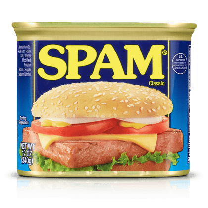

# spam-i-am



## Teacher-Led Project at Dev Academy Aotearoa

### Not sponsored by Hormel Foods Corporation (yet)

---

Welcome to the wonderful world of SPAM! This teacher-led, spam-packed project is designed to help you learn to work collaboratively as a cohort on a single large project. Here you'll consolidate your Bootcamp learnings, write code that prioritizes quality, and become familiar with a more complex codebase.

## About

This project is a playful and engaging web platform designed for SPAM enthusiasts, featuring interactive games, community ratings, and quirky content focused on SPAM. The core MVP offers a fun experience with games, ratings, comments, and a personality quiz, while stretch goals envision deeper customization and user-generated content.

## MVP Features

- **Friendly Home Page:** Welcoming users with a bold image or animation to set a fun atmosphere.
- **About Page:** Educating users about the (fictional, funny) history of SPAM.
- **Games Section:** Users can play entertaining mini-games themed around SPAM, including Spam Jump, Whack A Spam, and Snake.
- **Rating System:** Users can view all SPAM ratings and submit their own, dynamically affecting the site’s average SPAM scores.
- **Commenting:** Community members can read and add comments about different types of SPAM.
- **Personality Quiz:** Users discover which SPAM flavor matches their personality, adding to the fun.

## Stretch Goals

- **Tofu Toggle:** Switch the site to a vegan-friendly experience, where SPAM becomes TOFU in games.
- **Advanced Gaming:** Save scores in Snake and compete on leaderboards.
- **Customization:** Users can enhance their profile with badges and logs (“splog”).
- **Recipe Sharing:** Community members upload SPAM recipes and photos, fostering culinary creativity.
- **Fan Picture Gallery:** Users can upload their own SPAM-related photos to a community gallery.
- **Email Newsletter:** Weekly SPAM-themed updates sent to engaged users.

## Tech Stack

### Frontend
- **React 18** - UI library
- **TypeScript** - Type-safe JavaScript
- **Vite** - Build tool and dev server
- **React Router** - Client-side routing
- **TanStack Query** - Data fetching and state management
- **Tailwind CSS** - Utility-first CSS framework
- **Material UI** - React component library
- **Auth0** - Authentication

### Backend
- **Node.js** - JavaScript runtime
- **Express** - Web framework
- **TypeScript** - Type-safe JavaScript
- **Knex.js** - SQL query builder
- **SQLite3** - Database
- **JWT** - Authentication tokens
- **Swagger** - API documentation

### Testing & Development
- **Vitest** - Unit testing framework
- **Testing Library** - React testing utilities
- **ESLint** - Code linting
- **Prettier** - Code formatting
- **GitHub Actions** - CI/CD

---

## Onboarding

1. **Create a Conflict Resolution Plan**
2. **Fill out your stress profile**
3. **Assign Vibes Leads Roles**
4. **Install and run the app**
5. **Explore the codebase**

---

## Company Conventions

1. We use [Semantic Commit Messages](https://gist.github.com/joshbuchea/6f47e86d2510bce28f8e7f42ae84c716)—please familiarize yourself with the specifications.
2. Pull requests are announced on Discord using:  
   **#issue number, issue name, link, short summary**
3. Tag a senior dev / git lead when requesting a code review.
4. Use the provided pull request template.
5. Celebrate merges with crazy gifs!
6. Senior dev / git lead announces merges on Discord—the team must pull after every merge.
7. Keep the codebase clean.
8. Write code that is understandable for all developers, with clear comments.
9. We use [Tailwind CSS](https://tailwindcss.com/)—get familiar; see also `tailwind.config.js`.
10. Everyone must eat at least three cans of spam weekly.
11. Practice clear communication and ASK (Actionable, Specific, Kind) feedback.
12. Uphold IKE values.

---

## External Documentation

- [Figma wireframes](https://www.figma.com/design/vuRQXZ9V8QIMZPrJ3oKrpf/SPAM?node-id=0-1)
- [ERD Diagram](./resources/ERD-diagram.png)

---

## Getting Started

1. Clone this repository and explore the codebase.
2. Run setup commands:

```
npm i
npm run knex migrate:latest
npm run knex seed:run
npm run dev
```

3. (Optional) Install the [Tailwind CSS IntelliSense VS Code Extension](https://marketplace.visualstudio.com/items?itemName=bradlc.vscode-tailwindcss)

---

## Git Workflow

<summary>How to contribute to this project</summary>

- **Main branch is protected—you can't push directly!**
- The name of your branch is equal to the Issue-Number/Ticket-name - for example `git checkout -b issue-8/add-login-button`
- Make changes in your own branch, and commit/push to GitHub.
- Commit frequently with **good quality commit messages**
- To come up with thoughtful commits, consider the following:

1.  Why have I made these changes?
2.  What effect have my changes made?
3.  Why was the change needed?
4.  What are the changes in reference to?

- When your ticket is complete, push changes and raise a pull request.
- After merge, Git Leads will announce; everyone should pull main into their branches.

---

### Branch Protection & CI/CD

The `main` branch has the following protections enabled:

- **Pull requests required** - You cannot push directly to main
- **Status checks must pass** - All tests must pass before merging
- **GitHub Actions CI** - Automated tests run on every push and pull request

Our CI workflow (`.github/workflows/ci.yml`) automatically runs tests on:
- Every push to `main` branch
- Every pull request targeting `main` branch

If tests fail, the pull request cannot be merged. This ensures code quality and prevents broken code from reaching main.

---

## Working With Tickets

<summary>How to pick up and work on tickets</summary>

- Check the Project Board (in the Projects tab) for tickets/issues.
- Assign yourself and your pair to the ticket you want.
- Move your ticket to the 'In progress' column while working.
- Move your ticket to the 'For review' column after creating pull request.
- When done and merged, git lead or senior dev will close the issue and move your ticket to 'Done'.

---

## API Documentation

All API endpoints are prefixed with `/api/v1`.

### 🚀 Interactive API Documentation

**Swagger UI** is available at: **[http://localhost:3000/api-docs](http://localhost:3000/api-docs)**

Once the server is running (`npm run dev`), visit the Swagger UI to:
- View all available endpoints
- See request/response schemas
- **Test API calls directly in your browser**
- Generate code examples

The OpenAPI specification is available in `openapi.yaml` at the root of the project.

---

### Quick Reference

### About Routes

| Method | Endpoint | Auth Required | Description |
|--------|----------|---------------|-------------|
| GET | `/about/text` | No | Get all about page text content |
| GET | `/about/images` | No | Get all about page images |

**Example Response (GET /about/text):**
```json
[
  {
    "id": 1,
    "section": "intro",
    "content": "Welcome to SPAM history..."
  }
]
```

---

### Comments Routes

| Method | Endpoint | Auth Required | Description |
|--------|----------|---------------|-------------|
| GET | `/comments/:spamId` | No | Get all comments for a specific SPAM flavor |
| POST | `/comments` | **Yes** | Add a new comment to a SPAM flavor |
| PATCH | `/comments/:id` | **Yes** | Update a comment (TODO: Implement in ticket) |
| DELETE | `/comments/:id` | **Yes** | Delete a comment (TODO: Implement in ticket) |

**Example Request (POST /comments):**
```json
{
  "spamId": 2,
  "comment": "This flavor is amazing!"
}
```

**Example Response (GET /comments/2):**
```json
{
  "comments": [
    {
      "id": 1,
      "user_id": "auth0|xxx123",
      "spam_id": 2,
      "comment_text": "Great flavor!",
      "created_date": 1625152800
    }
  ]
}
```

---

### Quiz Routes

| Method | Endpoint | Auth Required | Description |
|--------|----------|---------------|-------------|
| GET | `/quiz` | No | Get all quiz questions with options |
| GET | `/quiz/:category` | No | Get quiz result by category (TODO: Implement in ticket) |

**Example Response (GET /quiz):**
```json
[
  {
    "id": 1,
    "question_text": "What's your favorite activity?",
    "options": [
      {
        "id": 1,
        "option_text": "Reading",
        "category": "classic"
      }
    ]
  }
]
```

---

### Ratings Routes

| Method | Endpoint | Auth Required | Description |
|--------|----------|---------------|-------------|
| GET | `/ratings` | No | Get all ratings for all SPAM flavors |
| GET | `/ratings/:spamId` | No | Get average rating for a specific SPAM flavor |
| POST | `/ratings` | **Yes** | Add a new rating (TODO: Implement in ticket) |

**Example Response (GET /ratings/2):**
```json
{
  "rating": 4.5
}
```

**Example Request (POST /ratings - to be implemented):**
```json
{
  "spamId": 6,
  "rating": 5
}
```

---

### SPAM Routes

| Method | Endpoint | Auth Required | Description |
|--------|----------|---------------|-------------|
| GET | `/spams` | No | Get all SPAM flavors |
| GET | `/spams/:id` | No | Get a specific SPAM flavor by ID |
| POST | `/spams` | No | Create a new SPAM flavor |
| PATCH | `/spams/:id` | No | Update a SPAM flavor |
| DELETE | `/spams/:id` | No | Delete a SPAM flavor |

**Example Response (GET /spams):**
```json
{
  "spams": [
    {
      "id": 1,
      "name": "Classic",
      "description": "The original SPAM",
      "image": "/images/classic.png"
    }
  ]
}
```

---

### Users Routes

| Method | Endpoint | Auth Required | Description |
|--------|----------|---------------|-------------|
| POST | `/users` | **Yes** | Create or update a user (upsert) |
| GET | `/users/:auth0Id` | No | Get user by Auth0 ID |

**Example Request (POST /users):**
```json
{
  "userName": "spamfan123",
  "email": "spam@example.org"
}
```

**Example Response (GET /users/auth0\|xxx123):**
```json
{
  "auth0_id": "auth0|xxx123",
  "user_name": "Roger",
  "email": "roger@example.org"
}
```

---

### Accessing Authenticated Routes

<details>

#### Getting an access token

Suppose you want to generate an access token for a user (e.g. our example user `fakeuser@example.org`) so that you can test your server-side routes.

- Open Postman and fill in the following information:

- URL: **POST** `https://dev-academy-spam.au.auth0.com/oauth/token`
- **_For POSTMAN:_** Change the body to `x-www-form-urlencoded` and fill the following key/value pairs:

| key           | value                                                            |
| ------------- | ---------------------------------------------------------------- |
| audience      | https://spam/api                                                 |
| grant_type    | password                                                         |
| client_id     | qzDoSfqNCCOHYee9ULEri6OLnOKO80h3                                 |
| client_secret | ccKbF8P-TlBAHbKIO_ZgpGBF2w6S1SxupVdlMHN0bz0ZQ1TIj-PvH4NLnevQT7lw |
| username      | username for that user (e.g. `fakeuser@example.org`)             |
| password      | and the password for that user (e.g `fakeUser5000!`)             |

**NOTE**: access tokens expire after 24 hours, and you will need to generate a new token by using the same endpoint with the values from above.
It's a good idea to keep the HTTP request in POSTMAN because you'll need it for later.

</details>
